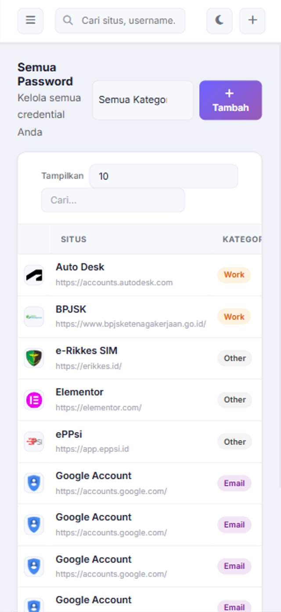
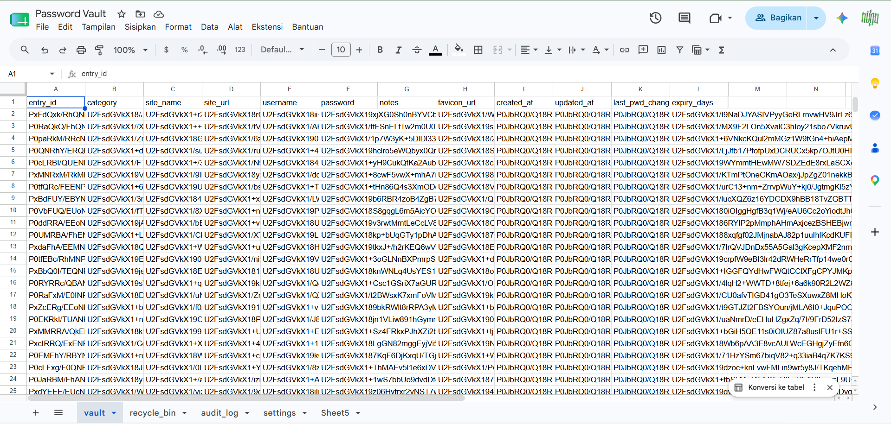

# Password Vault (Google Apps Script)

A secure, personal password management solution built entirely on Google Apps Script and Google Sheets. This application provides a high-security interface to store, manage, and audit your digital credentials.

---

## Overview

**Password Vault** is designed for users who want full control over their data by hosting it within their own Google account. It uses a sophisticated "Double-Layer Encryption" strategy combining server-side `ScriptProperties` and client-side processing to ensure that sensitive data remains protected.

---

## Features

### 🔒 Security & Privacy
- **Auth Gate:** Email whitelist protection for restricted access.
- **Double-Layer Encryption:** Uses `PropertiesService` combined with dynamic session keys.
- **Auto-Lock:** Customizable countdown timer to lock the vault after inactivity.
- **Security Hardening:** Masking on blur, clipboard auto-clear, and anti-screenshot hints.
- **Breach Check:** Integrated with Have I Been Pwned (HIBP) using k-anonymity SHA1.

### 🛠 Vault Management
- **Full CRUD:** Create, Read, Update, and Delete vault entries.
- **Recycle Bin:** 30-day data retention for accidental deletions.
- **Duplicate Detection:** Prevents redundant entries.
- **Password Utilities:** Built-in strength meter and secure password generator.
- **Favicon Auto-fetch:** Automatically retrieves site icons via secure proxy.

### 🖥 User Interface
- **Responsive Design:** Mobile-friendly layout using Bootstrap 5.
- **Dark / Light Mode:** Switchable themes for better readability.
- **Advanced Tables:** Powered by DataTables for fast searching, sorting, and pagination.
- **Interactive Feedback:** SweetAlert2 for professional modals and notifications.

---

## Technology Stack

| Category | Technology |
|----------|------------|
| Backend | Google Apps Script |
| Database | Google Sheets |
| Frontend | HTML5 |
| Styling | CSS3 |
| Framework | Bootstrap 5 |
| Scripting | JavaScript (ES6+) |
| Library | jQuery, DataTables |
| Icons | Font Awesome |
| Security | CryptoJS / Utilities (XOR + Base64) |

---

## Project Structure

```text
password-vault-gas/
│
├── gas/
│   ├── Kode.js             # Server-side logic (Google Apps Script)
│   └── appsscript.json     # Manifest file
│
├── docs/                   # Screenshots and documentation assets
│   ├── preview-desktop.png
│   ├── preview-mobile.png
│   └── preview-spreadsheet.png                 
│
├── views/
│   ├── Index.html          # Main Entry Point
│   ├── css.html            # UI Styles & Theme definitions
│   └── Script.html         # Frontend Logic & SPA Controller
│
├── CHANGELOG.md
└── README.md
```

---

## Security Workflow

Aplikasi ini menggunakan mekanisme keamanan berlapis untuk memastikan data sensitif Anda tidak pernah tersimpan dalam bentuk teks biasa (plain-text):

1.  **Client-Side Encryption:** Password dienkripsi di browser menggunakan kunci sesi sebelum dikirim ke server.
2.  **Server-Side Relay:** Google Apps Script menerima data terenkripsi.
3.  **Double-Layer Encryption:** Data dienkripsi kembali menggunakan kunci unik yang disimpan di `ScriptProperties` sebelum ditulis ke Google Sheets.
4.  **Decryption:** Proses dibalik saat data dipanggil, memerlukan autentikasi yang valid dan sesi aktif.

---

## Spreadsheet Requirements

Untuk menjalankan aplikasi ini, Google Sheet Anda harus memiliki sheet dengan nama dan struktur kolom sebagai berikut:

### 1. Main Vault (`vault`)
Menyimpan semua kredensial utama dalam kondisi terenkripsi.
*   **Headers:** `entry_id`, `category`, `site_name`, `site_url`, `username`, `password`, `notes`, `favicon_url`, `created_at`, `updated_at`, `last_pwd_change`, `expiry_days`

### 2. Audit Log (`audit_log`)
Mencatat setiap aktivitas akses untuk keperluan audit keamanan.
*   **Headers:** `timestamp`, `email`, `action`, `entry_id`, `notes`, `user_agent`

### 3. Recycle Bin (`recycle_bin`)
Penyimpanan sementara untuk data yang dihapus (Retensi 30 hari).
*   **Headers:** `entry_id`, `category`, `site_name`, `site_url`, `username`, `password`, `notes`, `favicon_url`, `created_at`, `updated_at`, `last_pwd_change`, `expiry_days`, `deleted_at`, `deleted_by`

### 4. User Settings (`settings`)
Konfigurasi personalisasi per akun pengguna.
*   **Headers:** `email`, `auto_lock_minutes`, `clipboard_seconds`, `default_expiry_days`, `dark_mode`, `show_password_default`, `pd_sitename`, `pd_siteurl`, `pd_category`, `pd_username`, `pd_notes`, `pd_favicon`

---

## Screenshots

### Desktop View


### Mobile View



### Spreadsheet View



---

## Deployment

### Clone Repository

```bash
git clone https://github.com/arisnurmahendra/password-vault-gas.git
```

### Deploy to Google Apps Script

1. Create a new Google Apps Script project.
2. Copy all files from `/gas` and `/views`.
3. Deploy as Web App.
4. Configure access permissions.
5. Publish and share the generated URL.

---

## Future Improvements

- **Biometric Auth Integration:** Menggunakan WebAuthn API untuk login via Fingerprint/FaceID.
- **Batch Import/Export:** Fitur untuk migrasi data dari file CSV (Chrome/Bitwarden export).
- **Multi-User Collaboration:** Fitur berbagi *folder* atau kredensial tertentu dengan user whitelist lainnya.
- **Browser Extension:** Integrasi langsung sebagai ekstensi browser untuk fitur *auto-fill*.
- **Mobile App (PWA):** Optimasi lebih lanjut untuk pengalaman aplikasi native di perangkat mobile.

---

## Author

**Aris Nur Mahendra**

Software Engineer

- LinkedIn: *https://www.linkedin.com/in/arisnurmahendra*
- Portfolio: *https://sites.google.com/view/arisnurmahendra*

---

## License

Licensed under the Apache License 2.0.

See the LICENSE file for more information.

---

## Acknowledgements

- Google Apps Script
- Bootstrap 5 & Font Awesome 6
- jQuery & DataTables
- SweetAlert2 (Modals & Notifications)
- CryptoJS (Client-side encryption)
- Open Source Community

---

### Version

Current Version: **1.0.0.2**

Release Date: **2026-06-17**

*See CHANGELOG.md for full history.*
