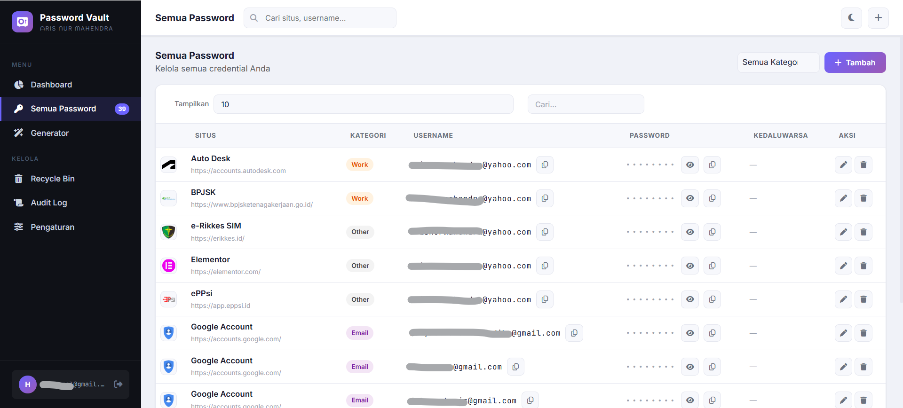

# Password Vault (Google Apps Script)

A secure, personal password management solution built entirely on Google Apps Script and Google Sheets. This application provides a high-security interface to store, manage, and audit your digital credentials.

---

## Overview

**Password Vault** is designed for users who want full control over their data by hosting it within their own Google account. It uses a sophisticated "Double-Layer Encryption" strategy combining server-side `ScriptProperties` and client-side processing to ensure that sensitive data remains protected.

---

## Features

### 🔒 Security & Privacy
- **Auth Gate:** Email whitelist protection for restricted access.
- **Double-Layer Encryption:** Uses `PropertiesService` combined with dynamic session keys.
- **Auto-Lock:** Customizable countdown timer to lock the vault after inactivity.
- **Security Hardening:** Masking on blur, clipboard auto-clear, and anti-screenshot hints.
- **Breach Check:** Integrated with Have I Been Pwned (HIBP) using k-anonymity SHA1.

### 🛠 Vault Management
- **Full CRUD:** Create, Read, Update, and Delete vault entries.
- **Recycle Bin:** 30-day data retention for accidental deletions.
- **Duplicate Detection:** Prevents redundant entries.
- **Password Utilities:** Built-in strength meter and secure password generator.
- **Favicon Auto-fetch:** Automatically retrieves site icons via secure proxy.

### 🖥 User Interface
- **Responsive Design:** Mobile-friendly layout using Bootstrap 5.
- **Dark / Light Mode:** Switchable themes for better readability.
- **Advanced Tables:** Powered by DataTables for fast searching, sorting, and pagination.
- **Interactive Feedback:** SweetAlert2 for professional modals and notifications.

---

## Technology Stack

| Category | Technology |
|----------|------------|
| Backend | Google Apps Script |
| Database | Google Sheets |
| Frontend | HTML5 |
| Styling | CSS3 |
| Framework | Bootstrap 5 |
| Scripting | JavaScript (ES6+) |
| Library | jQuery, DataTables |
| Icons | Font Awesome |
| Security | CryptoJS / Utilities (XOR + Base64) |

---

## Project Structure

```text
password-vault/
│
├── gas/ (or root)
│   ├── Code.gs             # Server-side logic & API
│   └── appsscript.json     # Manifest file
│
├── views/
│   ├── Index.html          # Main Entry Point
│   ├── Style.html          # CSS Styles
│   └── Script.html         # Frontend Logic
│
├── LICENSE
├── CHANGELOG.md
└── README.md
```

---

## Print Layout Workflow

```text
Normal View
      │
      ▼
Before Print Event
      │
      ▼
Dynamic Section Reordering
      │
      ▼
Multi-Column Print Layout
      │
      ▼
Browser Print Engine
      │
      ▼
PDF / Printer Output
      │
      ▼
After Print Event
      │
      ▼
Restore Original Layout
```

---

## Print Section Order

When printing, the application automatically rearranges content into the following order:

1. Contact
2. Profile Summary
3. Skills
4. Applied Skills
5. Education
6. Experience
7. Achievements

This ensures a professional reading flow and optimal page utilization.

---

## Screenshots

### Desktop View

> Add screenshot here

```md

```

### Print Preview

> Add screenshot here

```md

```

---

## Deployment

### Clone Repository

```bash
git clone https://github.com/yourusername/interactive-cv.git
```

### Deploy to Google Apps Script

1. Create a new Google Apps Script project.
2. Copy all files from `/gas` and `/views`.
3. Deploy as Web App.
4. Configure access permissions.
5. Publish and share the generated URL.

---

## Future Improvements

- Dark mode support
- Additional language packs
- Portfolio gallery integration
- Dynamic CV generator from Google Sheets
- Download as PDF button
- Theme customization

---

## Author

**Aris Nur Mahendra**

Software Engineer

- LinkedIn: *https://www.linkedin.com/in/arisnurmahendra*
- Portfolio: *https://sites.google.com/view/arisnurmahendra*

---

## License

Licensed under the Apache License 2.0.

See the LICENSE file for more information.

---

## Acknowledgements

- Google Apps Script
- Bootstrap
- Font Awesome
- jQuery
- Open Source Community

---

### Version

Current Version: **v1.0.0**

Release Date: **June 2026**
